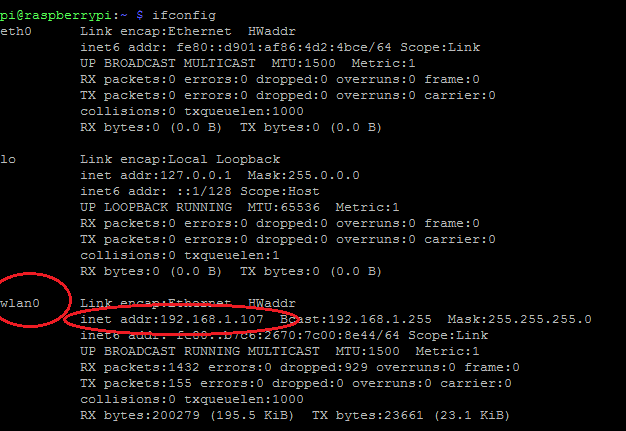

# Raspberry PI 3 Quick start Guide

Notes to myself for getting a raspi up and operational quickly for remote node testing. 

## 1. Download Raspbian Lite

Assuming you don't need the desktop, raspbian lite is a trimmed simple distro that is designed for the raspberry pi. 

<p align='center'></p>

https://www.raspberrypi.org/downloads/raspbian/

## 2. Download Etcher

Unzip the image and you should get an .iso file. Write this to your SD card with etcher: 

https://etcher.io/

<p align='center'></p>

An alternative is Win32 disk imager.

## 3. Raspberry Pi Startup

1. Plug SD Card into your raspi.
2. Plug in HDMI monitor & keyboard. You must do this before boot. 
3. Apply power
4. You should see a boot sequence then be prompted for a login. Use the following:
Username: ``pi``
Password ``raspberry``

## 4. Enable SSH 

SSH gives you network access to the raspi. First type

```bash
sudo raspi-config
```
Next step is distro dependent but for me, its under **Advance Options** and then **Enable SSH**. By default, this is off. 

## 5. Wifi setup.

Type the following: 

```
sudo nano /etc/wpa_supplicant/wpa_supplicant.conf
```

Add this to the end of the file: 

```
network={
    ssid="testing"
    psk="testingPassword"
}
```

Then save & exit. Next reboot with:

```
sudo reboot
```

You can test your internet connection with `` ifconfig `` and `` ping 8.8.8.8 ``. Note the IPV4 IP w/ `` ifconfig`` . You will need this for SSH. 

<p align='center'></p>


## 6. Using SSH

I would reccomend using putty. In the command prompt of windows, type ``putty.exe -ssh [yourIP]``. You now have shell access to your raspi. 

<p align='center'></p>

